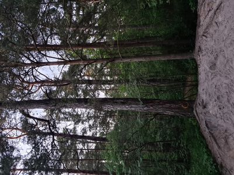

# Финиш!

<iframe width="100%" height="350" frameborder="0" scrolling="no" marginheight="0" marginwidth="0" src="https://www.openstreetmap.org/export/embed.html?bbox=24.857374727725986%2C59.46281962696416%2C24.85954195261002%2C59.463774952655896&amp;layer=mapnik&amp;marker=59.463297%2C24.858459100000005" style="border: 1px solid black"></iframe> <small><a href="https://www.openstreetmap.org/?mlat=59.46330&amp;mlon=24.85846#map=19/59.46330/24.85846&amp;layers=N">View Larger Map</a></small>